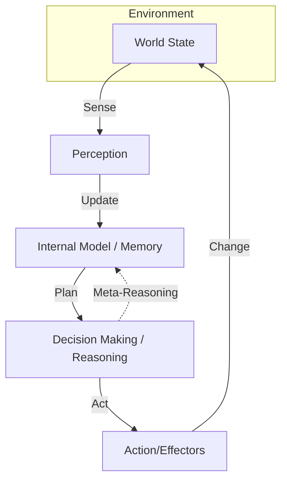

# Agent Loops

An AGI doesn't just process static data; it is an **Agent** that acts on an environment. The "Agent Loop" is the continuous cycle that keeps the system alive and pursuing goals.

## The Standard Cognitive Cycle

Most AGI architectures follow a variation of the **Sense-Think-Act** loop.

## Components of the Loop

### 1. Sensing (Perception)
Converting raw signals (camera, sensors, text) into internal representations. In Hyperon, this means creating "Atoms" in the AtomSpace.

### 2. Understanding (Modeling)
Updating the internal world model based on new evidence. If a sensed "Object" isn't where it was expected to be, the model is updated to reflect the new position.

### 3. Deliberation (Planning)
Searching through possible actions to find the one that best satisfies current goals. This uses the **Reasoning Engines**.

### 4. Action (Effection)
Sending commands to actuators (robot arms, web browsers, or text generators).

## Real-Time Constraints

In a true AGI, this loop must run at different speeds:
- **Reactive Loop**: Milliseconds (e.g., pulling a hand away from fire).
- **Deliberative Loop**: Seconds/Minutes (e.g., planning a route).
- **Reflective Loop**: Hours/Days (e.g., analyzing past performance to improve).

## Goal-Driven Autonomy

Unlike a chatbot that waits for a prompt, a goal-driven agent loop is always running. If there is no immediate task, the "Goal Manager" might trigger **Curiosity**—an internal goal to explore the environment or organize its own memory to be more efficient in the future.

---

Next: [Hyperon section](/docs/hyperon/overview)
