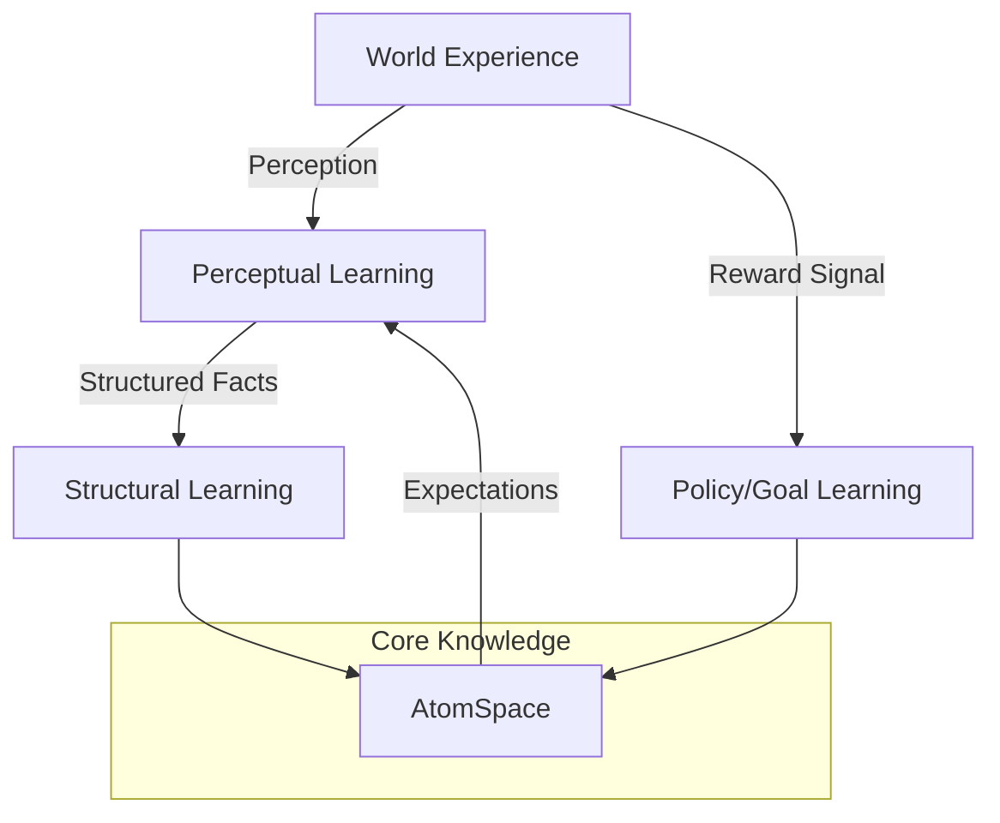

# Learning Modules

Learning in an AGI system is not a one-time "training phase." It is a continuous, multi-strategy process that happens as the agent interacts with the world.

## The Three Pillars of AGI Learning

### 1. Perceptual Learning
Adapting how the system perceives the world.
- **Mechanism**: Fine-tuning neural weights for better vision, speech, or pattern recognition.
- **Goal**: Turning raw data into clean "Atoms" for the memory.

### 2. Structural Learning
Modifying the knowledge graph (AtomSpace) itself.
- **Mechanism**: Adding new concept nodes, strengthening links between related items.
- **Goal**: Building a more accurate mental model of reality.

### 3. Program/Skill Learning
Discovering new algorithms or behavioral sequences.
- **Mechanism**: Program evolution (MOSES) or Reinforcement Learning (RL).
- **Goal**: Learning *how* to do things more efficiently.

## Learning Architecture

## Sample-Efficient Learning

One of the biggest challenges for AGI is **Sample Efficiency**. Unlike big neural nets that need trillions of tokens, an AGI must be able to learn from a single demonstration (one-shot learning) by using its existing knowledge to fill in the gaps.

## Metacognitive Learning

Advanced AGI systems learn about their own learning process (**Meta-Learning**).
- "Which reasoning strategy worked best for this type of problem?"
- "Do I need more data before I can make this decision?"

---

Next: [Agent Loops](/docs/architectures/agent-loops)
