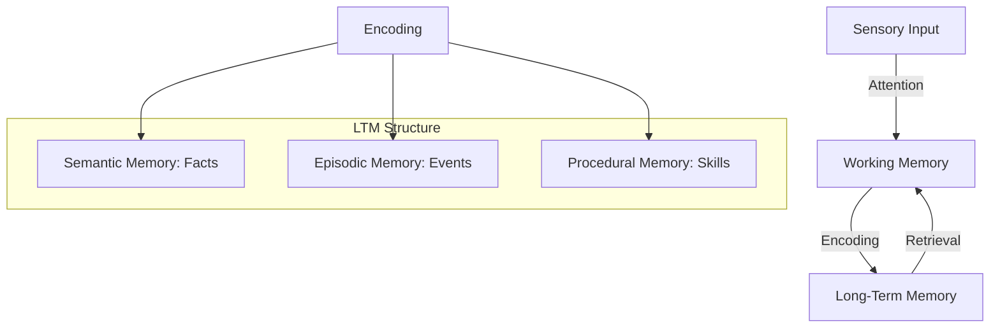

# Memory Systems

An AGI system cannot rely on a static weight matrix alone. It needs a dynamic, multi-layered memory system to store experiences, facts, and skills.

## The Multi-Layer Memory Model

AGI memory is often modeled after human cognitive psychology, distinguishing between different durations and types of information.

### 1. Short-Term / Working Memory (STM)
The "scratchpad" of the mind. It stores information currently being processed.
- **In AGI**: Attention windows, current state buffers, or "Active Atoms" in the AtomSpace.
- **Capacity**: Limited but highly accessible.

### 2. Long-Term Memory (LTM)
Persistent storage of knowledge and experience.

| Type | Description | AGI Implementation |
| :--- | :--- | :--- |
| **Episodic** | Personal experiences (events) | Narrative databases, timeline logs |
| **Semantic** | Facts and concepts (Socrates is a man) | Knowledge Graphs, AtomSpace |
| **Procedural** | Skills and habits (how to drive) | Learned policies, MeTTa scripts |

## Visualizing Memory Flow

## Forgetting and Consolidation

A crucial part of AGI memory is **Active Selection**. If a system remembers everything perfectly, it eventually becomes overwhelmed by noise.
- **Consolidation**: Moving important working memory items into LTM during "down-time" (similar to sleep).
- **Graceful Forgetting**: Lowering the Importance (STI/LTI) of rarely used Atoms until they are purged or archived.

## Implementation in Hyperon

In the Hyperon framework, memory is unified in the **AtomSpace**.
- Every Atom has **Attention Values** (STI/LTI).
- This allows the system to treat memory as a dynamic, self-organizing graph rather than a static database.

---

Next: [Reasoning Engines](/docs/architectures/reasoning-engines)
