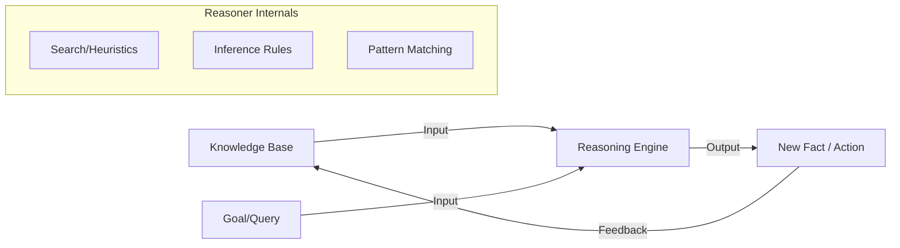

# Reasoning Engines

A reasoning engine is the component of a cognitive architecture that manipulates knowledge to derive new conclusions, solve problems, or plan actions.

## Types of Reasoning

### 1. Deductive Reasoning (Top-Down)
Applying general rules to specific cases.
- **Logic**: If $P \to Q$ and $P$ is true, then $Q$ must be true.
- **Strengths**: Truth-preserving, verifiable.

### 2. Inductive Reasoning (Bottom-Up)
Generalizing from specific observations to general rules.
- **Pattern Matching**: I've seen 100 white swans, so all swans are likely white.
- **Strengths**: Discovering new knowledge from data.

### 3. Abductive Reasoning (Explanation)
Finding the most likely explanation for an observation.
- **Inference**: The ground is wet $\to$ it probably rained.
- **Strengths**: Essential for diagnosis and causal understanding.

## The AGI Reasoner Pipeline

## Neuro-Symbolic Inference

Modern AGI reasoning combines the "feeling" of neural networks with the "logic" of symbolic engines.
- **Neural Layer**: Provides intuitive, fast suggestions for which rules to apply (heuristics).
- **Symbolic Layer**: Uses those rules to perform precise, verifiable steps.

## Key Reasoners in AGI

- **PLN (Probabilistic Logic Networks)**: Used in Hyperon to handle uncertainty.
- **SAT Solvers**: Used for hard logical constraints.
- **Differentiable Logic**: Neural networks that can perform logical operations.

---

Next: [Learning Modules](/docs/architectures/learning-modules)
