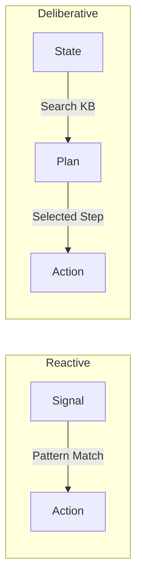

# Building Simple Agents

In this experiment, we walk through the design of two types of agents using the Hyperon AtomSpace.

## 1. The Reactive Agent
This agent acts immediately based on pattern matches in its environment.

**MeTTa Blueprint:**
```lisp
;; Fact: Sensor S1 detects Red
(Sensed red)

;; Rule: If Red, then Stop
(= (decide-action)
   (match (AtomSpace) (Sensed red) (Action stop)))

!(decide-action)
```

## 2. The Deliberative Agent
This agent plans ahead by "mentally" traversing its knowledge graph.

**MeTTa Blueprint:**
```lisp
;; Map facts
(Connects A B)
(Connects B C)

;; Goal: Reach C
(Goal C)

;; Recursive Plan Find
(= (find-path $start $target)
   (if (== $start $target)
       (List $target)
       (match (AtomSpace) (Connects $start $next)
              (List $start (find-path $next $target)))))

!(find-path A C)
;; Result: (List A (List B C))
```

## Visualizing the Difference



## Experiment Goal
Run these scripts in the MeTTa REPL and observe how the Deliberative agent can find paths through any connected graph, whereas the Reactive agent needs a new rule for every specific situation.

---

Next: [Toy Reasoning System](/docs/experiments/toy-reasoning)
