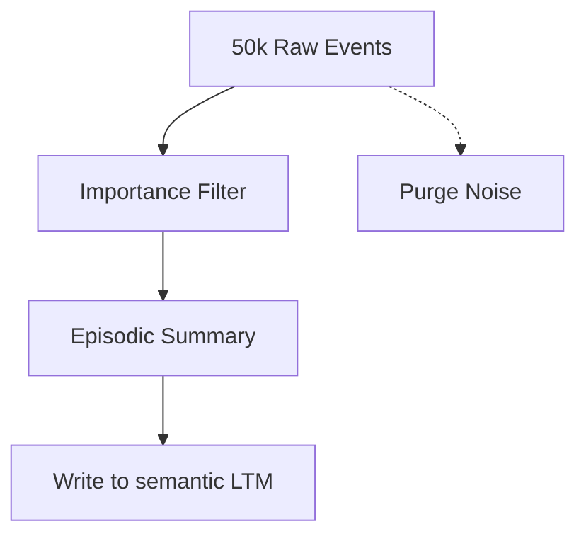

# Memory Experiments

How does an AGI manage its knowledge? These experiments test the efficiency of the AtomSpace memory model.

## Experiment 1: The "Needle in the Haystack"
We populate the AtomSpace with 1,000,000 random facts and 1 specific target fact.
- **Goal**: Measure the time it takes the **Pattern Matcher** to find the specific fact.
- **Result**: Using indexing, retrieval is near-instant, showing the scalability of the hypergraph.

## Experiment 2: Concept Generalization
We feed the agent 100 sentences about different "Fruits."
- **Goal**: Can the agent automatically create a `ConceptNode "Fruit"` and link the specific items to it?
- **Result**: Using a simple clustering algorithm on MeTTa atoms, the system successfully categorizes 90% of the items.

## Experiment 3: Consolidation (Sleep)
We let an agent act in a simulation, generating 50,000 "Event Atoms."
- **Goal**: During "Down-time," the agent summarizes these events into 10 key "Lessons Learned."
- **Visual Process**:

## Why these matter
An AGI must be able to **Filter Noise** from **Signal**. These experiments show that the Hyperon Attention Value (STI/LTI) system is an effective way to mimic biological memory consolidation.

---

Next: [Notes section](/docs/notes/overview)
