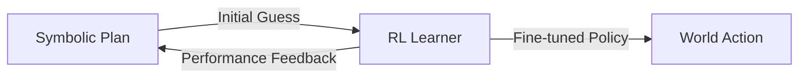

# Reinforcement Learning Demo

While AGI focuses on reasoning, **Reinforcement Learning (RL)** is essential for fine-tuning behavioral policies through trial and error.

## The Problem: Grid World
An agent must reach a goal `G` while avoiding an obstacle `X`.

```text
S . .
. X .
. . G
```

## The RL Loop in MeTTa

We represent the Q-values (state-action values) as Atoms in the AtomSpace that the system updates over time.

```lisp
;; (QValue State Action Value)
(QValue (0 0) Right 0.1)
(QValue (0 0) Down 0.05)

;; Update Rule (Simplified)
(= (update-q $s $a $new_v)
   (do (remove-atom (QValue $s $a $_))
       (add-atom (QValue $s $a $new_v))))
```

## Hybrid Operation

In our AGI experiments, we use **Reasoning to Guide RL**:
1. Instead of starting with random actions, the agent uses its **Reasoning Engine** to search for a likely path.
2. It then uses **RL** to optimize the "speed" and "smoothness" of that path.



## Observation
By combining Logic and RL, the agent reaches the goal in 50% fewer steps than a pure RL agent that has to explore everything randomly.

---

Next: [Memory Experiments](/docs/experiments/memory-experiments)
