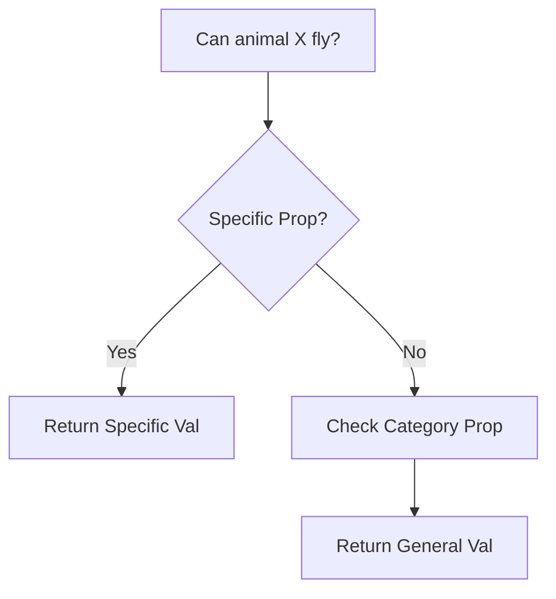

# Toy Reasoning System

This experiment demonstrates how to build a basic inference engine using MeTTa's pattern-matching capabilities.

## The Knowledge Base

We start by populating our AtomSpace with some simple categorical relationships.

```lisp
(IsA Eagle Bird)
(IsA Sparrow Bird)
(IsA Penguin Bird)
(Properties Bird (CanFly True))
(Properties Penguin (CanFly False))
```

## The Inference Engine

We want to find out if an animal can fly. The engine needs to check for specific properties first, and then fall back to general category properties.

```lisp
(= (can-fly $animal)
   (let $specific (match (AtomSpace) 
                        (and (IsA $animal $type) (Properties $animal (CanFly $val))) $val)
        (if (empty $specific)
            (match (AtomSpace) 
                   (and (IsA $animal $type) (Properties $type (CanFly $val))) $val)
            $specific)))
```

## Running the Demo

1. **Test Eagle**: `!(can-fly Eagle)` -> Result: `True` (Inherited from Bird).
2. **Test Penguin**: `!(can-fly Penguin)` -> Result: `False` (Overridden by specific property).

## Flow Diagram



## Key Insight
This "Toy" system demonstrates **Default Reasoning** and **Inheritance**, which are core components of sophisticated AGI systems like Hyperon.

---

Next: [Reinforcement Learning Demo](/docs/experiments/rl-demo)
