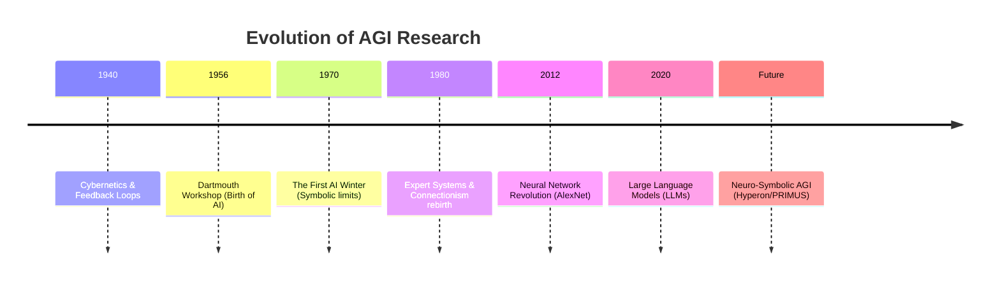

# History of AGI Research

The quest for Artificial General Intelligence has gone through several waves of optimism and "AI Winters." Understanding this history helps us avoid repeating past mistakes.

## The Early Vision (1940s-1950s)

The pioneers of computer science didn't aim for "Narrow AI"—they wanted to build minds.

- **Cybernetics (1940s)**: Figures like Norbert Wiener explored the idea of feedback loops and self-regulating systems, drawing parallels between machines and biological brains.
- **The Dartmouth Workshop (1956)**: Often cited as the birth of AI. John McCarthy, Marvin Minsky, and others proposed that "every aspect of learning or any other feature of intelligence can in principle be so precisely described that a machine can be made to simulate it."

## The Logic Wave (1960s-1980s)

During this era, researchers believed that human intelligence could be captured entirely through formal logic.

- **The Physical Symbol System Hypothesis**: Newell and Simon posited that manipulating symbols according to rules was the foundation of mind.
- **Expert Systems**: In the 70s and 80s, large "if-then" systems were built for medicine and engineering, but they were brittle and lacked "common sense."

## The Connectionist Wave (1980s-2010s)

As symbolic AI hit a wall, researchers returned to "Neural Networks."

- **Backpropagation (1986)**: Rumelhart, Hinton, and Williams showed how to train multi-layer neural networks.
- **Deep Learning Era (2012-Present)**: The explosion of compute and data made neural networks (deep learning) the dominant paradigm for vision, speech, and language.

## The AGI Timeline

## The Return to Generality

In 2008, the term **Artificial General Intelligence** was popularized by Ben Goertzel and others to distinguish their work from the "Narrow AI" that had become synonymous with the field. They argued that:

1.  Current AI is too task-specific.
2.  We need to return to **Cognitive Architectures**.
3.  Integration of different AI methods (Neural + Symbolic) is required for true generality.

---

Next: [Predictive and Causal Learning](/docs/foundations/predictive-causal-learning)
