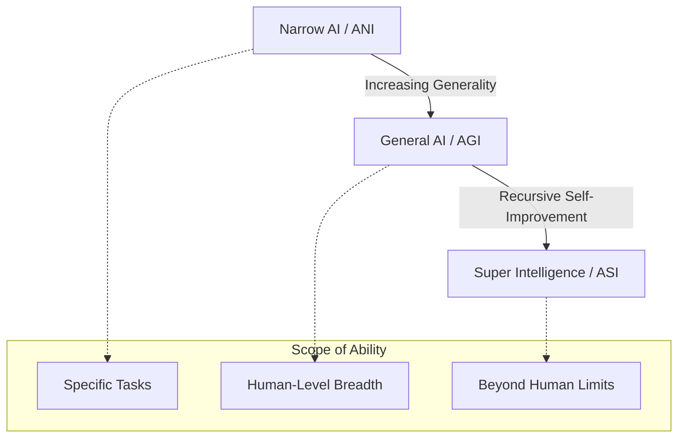

# The Intelligence Spectrum

In the field of Artificial Intelligence, we distinguish between different levels of capability and generality. Understanding these distinctions is crucial for setting research goals and evaluating progress.

## Definitions

### Narrow AI (Artificial Narrow Intelligence - ANI)
Most AI systems in use today are "Narrow." They are designed to perform a specific task or solve a specific problem.
- **Examples**: AlphaGo (playing Go), GPT-4 (processing text), Tesla Autopilot (driving).
- **Characteristic**: Exceptional at one thing, but completely incapable of tasks outside its training distribution.

### General AI (Artificial General Intelligence - AGI)
The goal of "The AGI Manual." AGI refers to a system that possesses the ability to understand, learn, and apply knowledge across as wide a range of tasks as a human being.
- **Status**: Theoretical / Research phase.
- **Characteristic**: Flexibility, cross-domain transfer, and autonomous goal-setting.

### Super Intelligence (Artificial Super Intelligence - ASI)
A level of intelligence that surpasses the collective brainpower of humanity across all fields, including scientific creativity, general wisdom, and social skills.
- **Status**: Future Speculation.
- **Characteristic**: Exponential self-improvement and problem-solving beyond human comprehension.

## Visualizing the Spectrum

The following diagram illustrates the relationship and progression between these levels:

## Comparisons

| Feature | Narrow AI (ANI) | General AI (AGI) | Super AI (ASI) |
| :--- | :--- | :--- | :--- |
| **Generality** | Low | High (Human-like) | Extreme |
| **Adaptability** | Fixed domain | Cross-domain | Infinite |
| **Learning** | Data-driven / Supervised | Autonomous / Meta-learning | Recursive Optimization |
| **Awareness** | Purely Functional | Cognitive Architecture | Likely Transcendent |

## Why AGI is the "Grand Prize"

Narrow AI is incredibly useful but requires human engineers to bridge the gaps between different tasks. An AGI system could, in theory, act as its own engineer—learning how to solve new problems without needing a human to re-code it. This lead to the concept of the **Intelligence Explosion**.

---

Next: [History of AGI Research](/docs/foundations/history)
