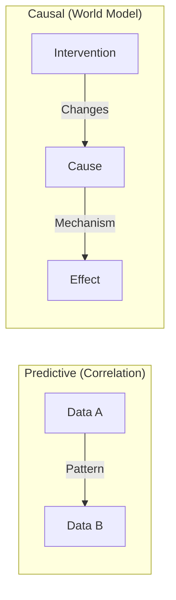

# Predictive and Causal Learning

To achieve AGI, a system must move beyond simple "curve fitting" or pattern recognition. It needs to understand **how the world works**.

## Predictive Learning (System 1)

Most modern AI (like Large Language Models) is primarily **predictive**. It learns to predict the next token, pixel, or state based on historical patterns.

- **Strengths**: Incredible speed, handles high-dimensional data (images/text), associative.
- **Weakness**: Lacks a "mental model" of physical reality. It can generate physically impossible scenarios because it only knows "what follows what" in data, not "why."

## Causal Learning (System 2)

Causal learning involves understanding the underlying mechanisms that govern events. It answers the question: **"If I do X, what will happen to Y?"**

- **Intervention**: The ability to test hypotheses (in reality or simulation).
- **Counterfactuals**: Reasoning about "what might have been" if a different action was taken.

## The Structural Difference

## Why Causal Learning is Essential for AGI

1. **Safety**: An AGI must understand the causal consequences of its actions to avoid unintended harm.
2. **Transfer Learning**: If you understand the causal rules of gravity, you can apply them on Earth or Mars. Predictive models often fail when the context changes slightly (distribution shift).
3. **Planning**: True planning requires a "World Model" where the agent can run mental simulations of cause and effect.

## Example: The Broken Lamp

- **Predictive AI**: Sees a picture of a lamp and a cat nearby. Predicts "Broken Lamp" because in many training images, cats knock things over.
- **Causal AGI**: Understands the physics of mass, force, and gravity. It knows that *if* the cat exerts X force on the lamp, the lamp *will* fall because it exceeds the stability threshold.

---

Next: [Architectures Overview](/docs/architectures/overview)
