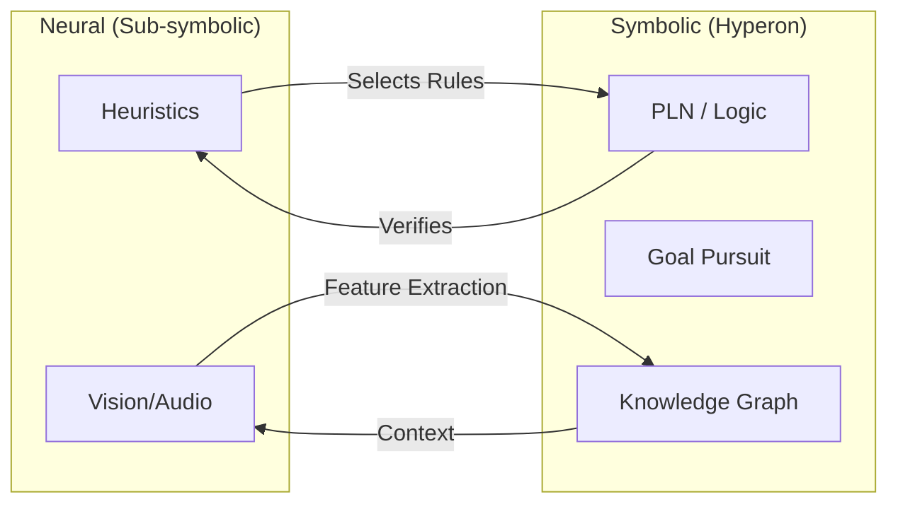

# Neural + Symbolic Integration

True AGI requires bridging the gap between the intuitive, perceptual power of neural networks and the logical, rigorous reasoning of symbolic AI. Hyperon is designed from the ground up to make this integration seamless.

## The Hybrid Model

In Hyperon, we don't choose between "Neurons" and "Symbols." Instead, we use each for what they are best at.



## Three Windows of Integration

### 1. Neural-to-Symbolic (Grounding)
Neural networks (like YOLO or BERT) process raw data and output **Atoms**.
- *Example*: A vision model detects a "Chair" and creates a `ConceptNode "Chair"` in the AtomSpace at specific coordinates.

### 2. Symbolic-to-Neural (Contextual Guidance)
The AtomSpace provides "Top-Down" expectations to neural models.
- *Example*: If the reasoner knows it is in a "Kitchen," it tells the vision model to increase its sensitivity for "Spoons" and "Plates."

### 3. Neuro-Symbolic Reasoning (Heuristics)
Neural networks are used to guide the search process of symbolic reasoners.
- *Problem*: Pure symbolic search can lead to a "combinatorial explosion" (too many possibilities).
- *Solution*: A neural network "feels" which reasoning paths are most likely to succeed, drastically pruning the search space.

## Implementation in MeTTa

MeTTa allows you to call neural models directly and treat their outputs as Atoms.

```lisp
;; Example of a MeTTa script calling a neural inference
(= (detect-intent $user_input)
   (py-call "model.classify" $user_input))

;; Using the neural output in a symbolic rule
(if (== (detect-intent "Help me") "ASK_HELP")
    (trigger-support-agent)
    (do-nothing))
```

## Why This Matters

This "Grand Unified" approach allows us to build systems that are as **robust** as neural nets but as **explainable and verifiable** as symbolic logic.

---

Next: [Why Hyperon Exists](/docs/hyperon/why-hyperon)
