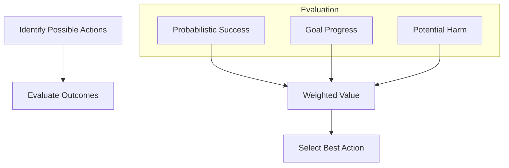

# Decision Making

Decision making is the process of choosing the "best" action among several alternatives. In AGI, this must happen under conditions of **Uncertainty** and **Limited Resources**.

## The Decision Framework

How does an AGI decide between `Action A` and `Action B`?

### 1. Utility Maximization
Assigning a "Value" to each possible outcome.
- **Formula**: $Value = Probability \times Utility - Cost$
- **AGI twist**: Utility isn't just about a score; it's about how much the outcome satisfies the agent's current **Drives**.

### 2. Multi-Criteria Decisions
Often, goals conflict. Should the agent be **Fast** or **Safe**?
- PRIMUS handles this by weighting different drives. If the agent is low on power, "Efficiency" gains weight over "Exploration."

## Decision Flow

## Bounded Rationality

In the real world, an AGI cannot think forever. It must make a "good enough" decision within a time limit. This is called **Satisficing**.
- If a high-utility action is found quickly, the agent might stop searching and act immediately rather than seeking the absolute perfect move.

---

Next: [Example Agent](/docs/primus/example-agent)
