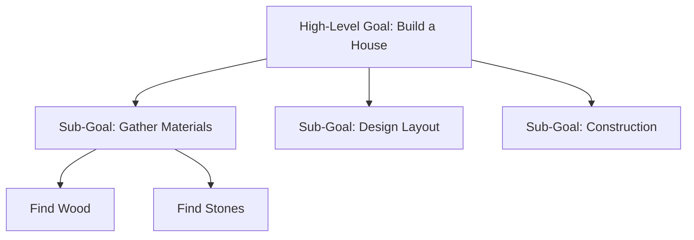

# Goal-Driven Behavior

In a cognitive architecture like PRIMUS, behavior isn't just a reaction to input; it is a proactive pursuit of internal goals.

## The Motivation System

Every PRIMUS agent has a set of **Drives** or **Primary Goals**. These might be:
- **Curiosity**: The drive to explore new patterns.
- **Homeostasis**: The drive to maintain internal stability (e.g., energy levels).
- **Social**: The drive to interact with other agents.

## Goal Hierarchies

Complex behavior requires breaking high-level goals into smaller, manageable sub-goals.

## Dynamic Re-prioritization

Unlike a static script, a PRIMUS agent can change its goals on the fly.
1. **Context Change**: If the agent is "Building a House" but suddenly senses a "Fire," the **Homeostasis** drive will override the building goal and create a new high-priority goal: "Escape Fire."
2. **Success/Failure**: If a task fails repeatedly, the agent might abandon the sub-goal and look for an alternative path.

## Goal-Pattern Matching

In PRIMUS, goals are often represented as "Desired Patterns" in the AtomSpace.
- **Current State**: `(At Agent Kitchen)`
- **Goal State**: `(At Agent Work)`
- **Reasoning**: Find a sequence of actions (patterns) that transform the current state into the goal state.

---

Next: [Planning Loops](/docs/primus/planning-loops)
