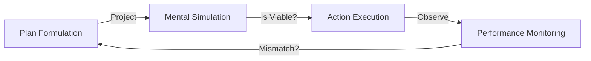

# Planning Loops

Planning is the process of generating a sequence of actions before executing them. In the real world, plans often fail, so the AGI must continuously monitor and adjust.

## The Planning Cycle

A planning loop in PRIMUS involves three main stages: **Projection**, **Execution**, and **Monitoring**.

### 1. Projection (Simulation)
The agent uses its "World Model" to imagine what would happen if it took certain actions. It doesn't act; it stays in its "head."

### 2. Execution
Once a viable plan is found, the agent sends commands to its actuators.

### 3. Monitoring (The Feedback Loop)
This is the most critical part. As the agent acts, it compares what *actually* happens with what it *projected* would happen.
- **Success**: Continue the plan.
- **Minor Error**: Adjust the plan (e.g., steer slightly left).
- **Major Error**: Stop and re-plan from scratch.

## Hierarchical Planning

AGI doesn't plan every muscle movement in its head. It plans at multiple levels of abstraction.
- **High-Level**: "Go to the supermarket."
- **Mid-Level**: "Walk to the front door."
- **Low-Level**: "Lift left leg."

This hierarchical approach allows the agent to be efficient—it doesn't need to re-think its entire shopping trip just because it tripped over a rug.

---

Next: [Decision Making](/docs/primus/decision-making)
