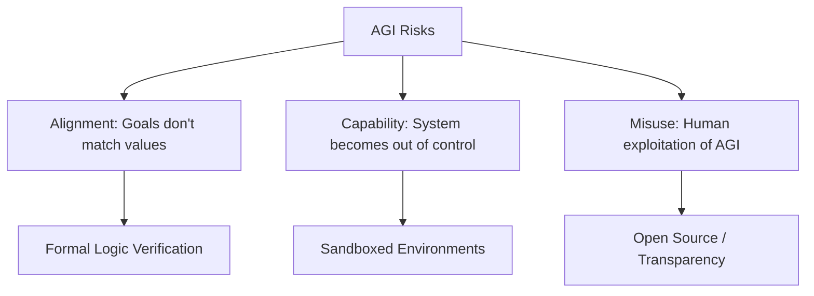

# Challenges and Risks

The road to AGI is paved with significant hurdles. Ignoring these challenges leads to hype and potential disaster.

## Technical Barriers

1. **The Combinatorial Explosion**: Symbolic search can grow exponentially. Finding the "right" reasoning path among trillions of possibilities without getting lost is a major open problem.
2. **The Grounding Problem**: Ensuring that a symbol like `Water` actually "means" something to the agent in terms of its physical properties and sensory experience.
3. **Decentralized Reasoning**: Coordinating thousands of reasoning engines across a distributed network without massive communication bottlenecks.

## Safety and Alignment Risks

## Socio-Economic Risks

- **Job Market Shock**: The rapid automation of "general" labor could outpace societal adaptation.
- **Concentration of Power**: If AGI is controlled by a single corporation or state, it could lead to unprecedented global inequality.

## Our Approach to Risk

We believe that **Transparency** is the best safety mechanism. By building AGI on open-source frameworks like Hyperon and MeTTa, we allow the global scientific community to audit the "thoughts" and "logics" of the agents we create.

---

Next: [Evaluation Metrics](/docs/roadmaps/metrics)
