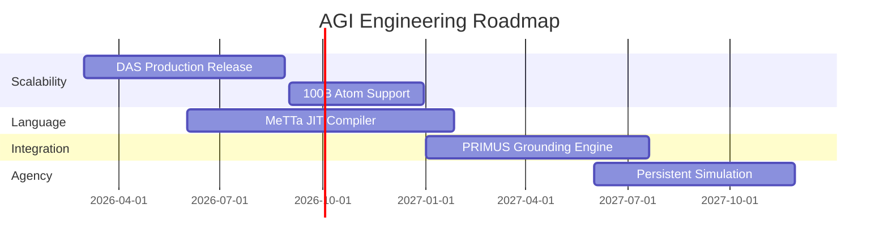

# Two-Year AGI Development Plan

This roadmap outlines the specific technical and organizational goals for the next 24 months in the Hyperon and PRIMUS ecosystems.

## Year 1: Foundation and Scalability

### Q1-Q2: DAS Release & Stabilization
- **Migration**: Full transition of research projects from in-memory AtomSpace to the Distributed AtomSpace (DAS).
- **Metric**: Support for 10 billion Atoms with sub-second query latency across a 10-node cluster.

### Q3-Q4: MeTTa Runtime Optimization
- **JIT Compilation**: Introduction of a Just-In-Time compiler for MeTTa rules to reach parity with native C++ execution speeds.
- **Python-MeTTa 2.0**: Deeper integration allowing automatic "Atomization" of Python objects and PyTorch models.

## Year 2: Integration and Agency

### Q1-Q2: Neuro-Symbolic "Grounding"
- **Unified Percepts**: Standardizing the PRIMUS PRUs to auto-generate MeTTa Atoms from real-time video feeds with 95% accuracy.
- **Symbolic Control**: First successful demonstration of a MeTTa reasoner controlling a complex robotic arm in an open-ended environment.

### Q3-Q4: The First "Persistent Agent"
- **Continual Learning**: An agent that runs 24/7 in a simulation, building a memory of its environment and showing **zero-shot** adaptation to new objects.
- **Metric**: Scoring in the top 10% of the ARC (Abstraction and Reasoning Corpus) without task-specific fine-tuning.

## Development Pipeline

---

Next: [Challenges and Risks](/docs/roadmaps/challenges-risks)
